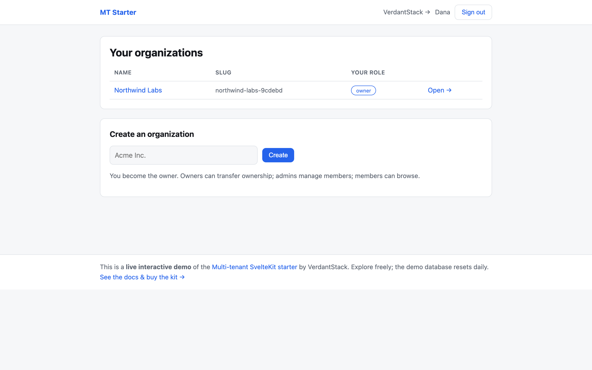
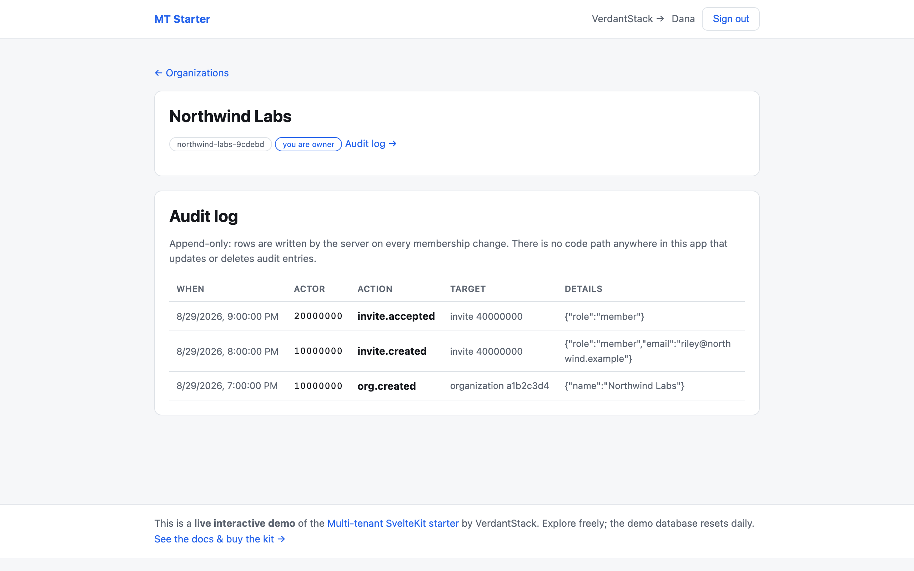
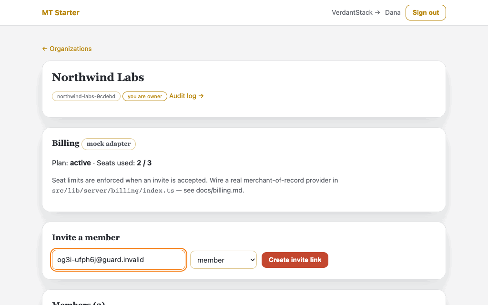
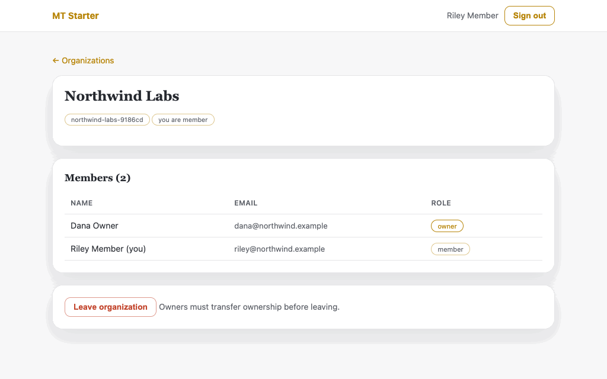
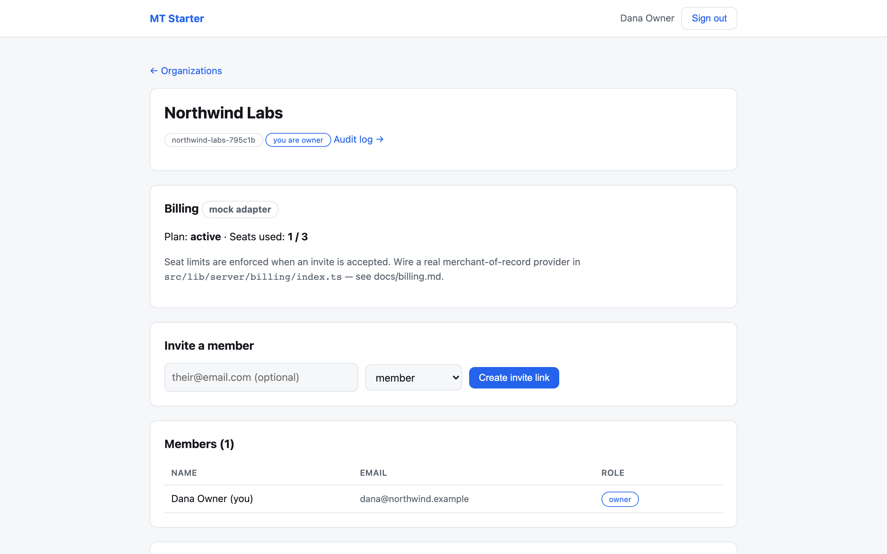
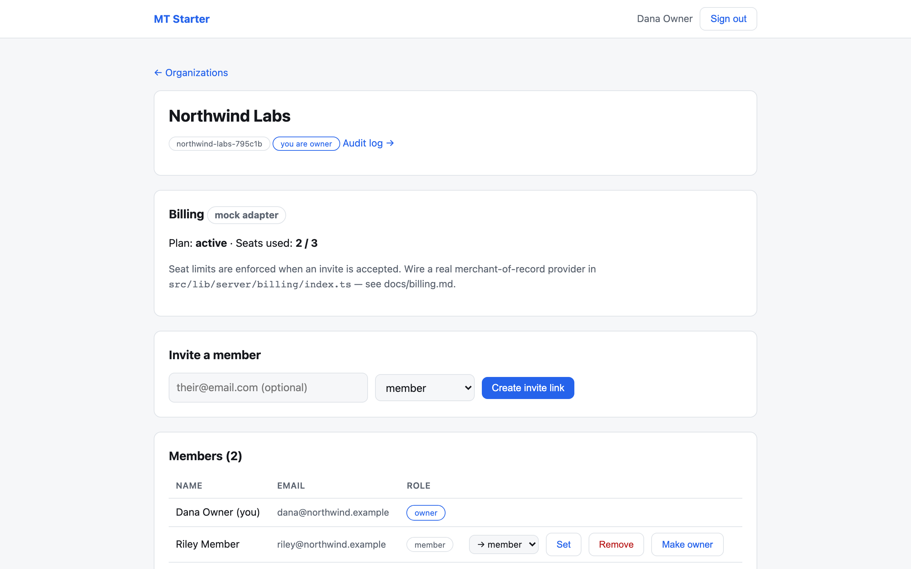
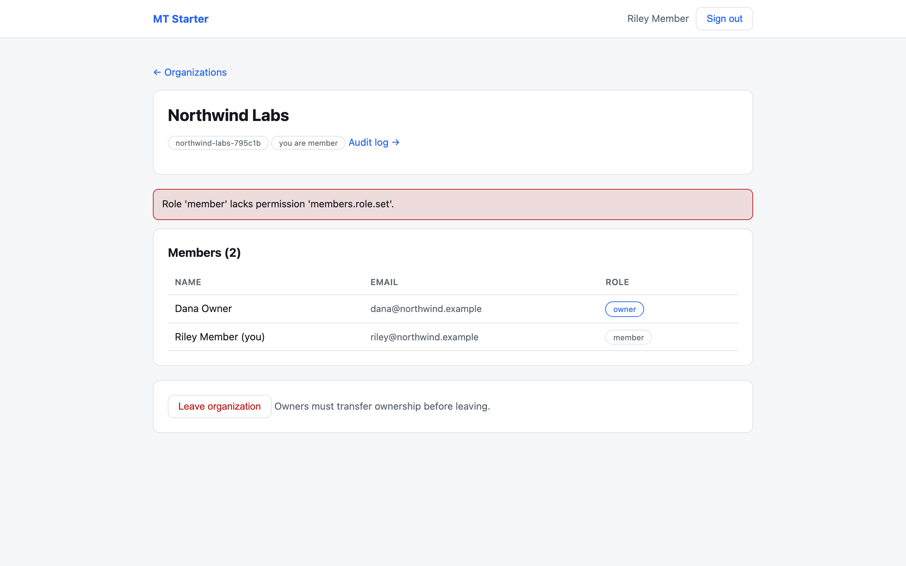
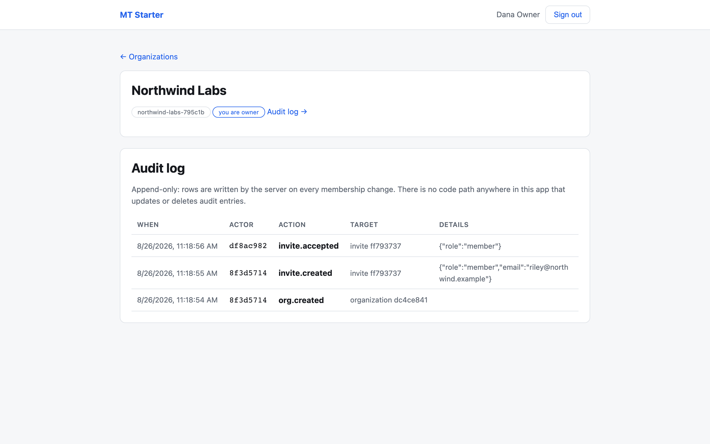
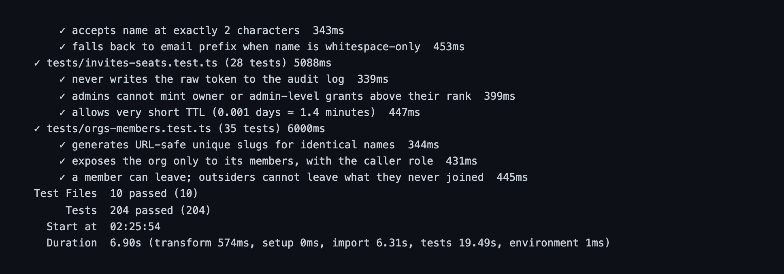

<p align="center">
  
</p>

<h3 align="center">Multi-tenant SvelteKit Starter</h3>

<p align="center">
  A production-shaped B2B SaaS foundation for <strong>SvelteKit</strong> with multi-tenancy wired end to end.
</p>

<p align="center">
  organizations & membership · invite links · role-based access control · seat-based billing · append-only audit log · failed-login rate limiting · tested where it hurts.
</p>

<p align="center">
  <a href="https://verdantstack-site.pages.dev/products/multi-tenant-sveltekit-starter/">Documentation & guides →</a>
</p>

---

> ## 🔒 Get the full source
>
> This repository showcases the **Multi-tenant SvelteKit Starter**: the feature
> list, architecture docs, and screenshots below. The complete production source
> code (auth, RBAC, seat billing, audit log, rate limiting, 204 tests) is included
> with your purchase.
>
> **Try the live demo → [multi-tenant-starter.verdantstack-site.pages.dev](https://multi-tenant-starter.verdantstack-site.pages.dev/)** — click through
> organizations, invites, RBAC, and the audit log for free (no login required to explore).
>
> **[Buy the kit →](https://www.paypal.com/ncp/payment/JF2586L8BQ858)** — one-time
> license · 30-day refund · **lifetime updates + lifetime standard support**.
> Questions? [verdantstack@proton.me](mailto:verdantstack@proton.me)

---

<!-- Metadata for AI agents and tooling -->
<!--
project_name: multi-tenant-sveltekit-starter
project_type: starter-kit
language: TypeScript
framework: SvelteKit
database: SQLite (better-sqlite3 + Drizzle ORM)
testing: Vitest
test_count: 77
license: Proprietary
version: 0.2.2
status: production-ready
changelog: https://github.com/verdantstack/multi-tenant-sveltekit-starter/blob/main/CHANGELOG.md
releases: https://github.com/verdantstack/multi-tenant-sveltekit-starter/releases
website: https://verdantstack-site.pages.dev/products/multi-tenant-sveltekit-starter/
repository: https://github.com/verdantstack/multi-tenant-sveltekit-starter
support_email: verdantstack@proton.me
support_patreon: https://www.patreon.com/cw/VerdantStack
features:
  - multi-tenancy
  - role-based-access-control
  - seat-billing
  - audit-log
  - rate-limiting
  - hashed-sessions
  - invite-links
tags: saas, starter, boilerplate, sveltekit, multi-tenant, rbac, billing, audit
-->

## Why this exists

Building a B2B SaaS? You'll need multi-tenancy, role-based access control, invite flows, seat-based billing, and an audit log. Every SaaS needs these. Every team rebuilds them from scratch.

This starter gives you all of them, wired together and tested, so you can focus on your actual product.

**What's included vs. free alternatives:**

| Feature | Free starters | This kit |
|---------|---------------|----------|
| Auth | ✅ | ✅ (scrypt + hashed sessions) |
| Dashboard | ✅ | ✅ |
| Multi-tenancy | ❌ | ✅ (orgs, memberships, invites) |
| RBAC | ❌ | ✅ (owner > admin > member) |
| Seat billing | ❌ | ✅ (pluggable adapter) |
| Audit log | ❌ | ✅ (append-only) |
| Rate limiting | ❌ | ✅ (sliding window) |
| Tests | 0–10 | 204 |

## See it in action

Real UI captured from the **live deployed demo** — [multi-tenant-starter.verdantstack-site.pages.dev/](https://multi-tenant-starter.verdantstack-site.pages.dev/) (seeded org, resets daily; click through free, no login needed to explore):

| Organizations home — sign in, pick an org | Audit log — every event recorded, append-only |
|---|---|
|  |  |

### Invite flow — real session, ~5s



### Role-based access control is enforced server-side — real session, ~3s

A member's view renders no admin controls; even a hand-crafted POST to promote the owner is rejected by the app with a real HTTP 403:



<details>
<summary>More screenshots (<code>docs/screenshots/</code>)</summary>

| Shot | Shows |
|---|---|
|  | Signup → org dashboard as owner |
|  | Seat count updated when a member joins |
|  | Member promotion attempt blocked by server policy |
|  | Append-only audit trail with event metadata |
|  | Verbatim `npm test` output — 204 passing |

</details>

## Status

**Version**: 0.2.2 | **Last Updated**: 2026-08-30 | **License**: Proprietary

[](CHANGELOG.md)
[](https://github.com/verdantstack/multi-tenant-sveltekit-starter/releases)
[](https://www.patreon.com/cw/VerdantStack)
[](https://github.com/verdantstack/multi-tenant-sveltekit-starter/blob/main/AGENTS.md)

- [x] Auth: email+password (scrypt), DB-backed revocable sessions, hashed session tokens
- [x] Rate limiting: sliding-window failed-attempt limiter on login/signup (verified over HTTP)
- [x] Orgs: create, slug, owner bootstrap
- [x] Invites: single-use hashed tokens, 7-day expiry, revoke, atomic claim
- [x] RBAC: `owner > admin > member`, capability matrix + hierarchy rules enforced server-side
- [x] Billing: `BillingAdapter` interface + `MockBillingAdapter` (seat limits enforced at join time)
- [x] Audit log: append-only by construction (no UPDATE/DELETE path exists)
- [x] Tests: **77 passing** covering auth, rate limiter, matrix, hierarchy, invite lifecycle, seat limits
- [x] `svelte-check` clean; production build clean; flows verified over HTTP end-to-end
- [ ] Real MoR billing adapter (in progress — plugs into the same `BillingAdapter` seam)

## Quick start

```bash
# 1. Install
npm install

# 2. Run
npm run dev            # http://localhost:5173

# 3. Test
npm test               # 204 tests (uses :memory: SQLite)
npm run check          # svelte-check

# 4. Edit schema
npm run db:generate    # after editing schema.ts → new SQL migration
```

**Verified from a clean copy:** fresh `npm install` → tests → check → dev server → signup all pass.

Data lives in `./data/app.db` (override dir with `DATA_DIR`). Migrations apply automatically at startup.

## Try the full loop

1. Sign up (min 10-char password) → you land on `/app`.
2. Create an organization → you are its `owner`.
3. Invite a member → a one-time link like `/invite/<token>` is shown **once** (stored hashed).
4. Open the link in a private window → sign up → you're in as `member`.
5. As owner, change roles, transfer ownership, or remove members; watch every event appear in the org's **Audit log** tab.
6. Hit the seat limit (default 3) and see the honest error.

## Environment variables

| Variable | Default | Purpose |
|----------|---------|---------|
| `DATA_DIR` | `./data` | Where the SQLite file lives |
| `MOCK_PLAN_SEATS` | `3` | Seat limit while on MockBilling |
| `AUTH_FAILED_ATTEMPTS` | `5` | Failed attempts allowed per window |
| `AUTH_WINDOW_MS` | `900000` | Sliding window for failed auth attempts |

## Where things live

| Path | Purpose |
|------|---------|
| `src/lib/server/db/schema.ts` | Drizzle schema — users, sessions, organizations, memberships, invites, audit_log |
| `src/lib/server/rbac.ts` | Roles, permission matrix, hierarchy helpers |
| `src/lib/server/auth.ts` | scrypt hashing, session issue/verify/revoke |
| `src/lib/server/ratelimit.ts` | `RateLimiter` seam + sliding-window failed-attempt limiter |
| `src/lib/server/services/` | Org / member / invite domain logic (pure functions taking `Db`) |
| `src/lib/server/billing/` | Adapter interface, mock implementation, wiring point |
| `drizzle/` | Checked-in SQL migrations (applied via `migrate()` at boot) |
| `tests/` | Vitest suites against `:memory:` databases |
| `docs/` | architecture · rbac · billing · license |

## Design rules worth knowing

- **Server-side enforcement everywhere**: UI hides controls, but every load/action re-checks membership and permissions against fresh DB state.
- **Failed logins are expensive for the attacker, cheap for you**: attempts are counted per IP+email behind a swappable seam, and blocked keys are rejected before any password hashing happens.
- **Hierarchy is strict**: actors act only downward (`owner > admin > member`); grants never reach the actor's own rank; the last owner can neither leave nor be removed.
- **Secrets are stored hashed**: invite tokens and session tokens exist raw only at the moment of use.
- **No ORM lock-in at the edges**: domain services accept any `Db`; swap SQLite for Postgres by replacing `db/index.ts`.
- **Audit is append-only**: writers only; readers query; nothing deletes.

## Versioning & Releases

**Standing Rule:** Releases are cut by the VerdantStack release pipeline (bump → changelog → tag → public release) — this repo has no `npm run release`. Merges must keep the tree green:

```bash
npm test               # 204 tests
npm run check          # svelte-check
npm run build          # production build
npm run docs:api:check # API reference in sync (typedoc)
```

See [CHANGELOG.md](CHANGELOG.md) for change history and [docs/versioning.md](docs/versioning.md) for the full process.

## License

The full source is included with your purchase under the
[End User License Agreement](https://verdantstack-site.pages.dev/docs/license/).

**[Buy the kit →](https://www.paypal.com/ncp/payment/JF2586L8BQ858)**

30-day refund policy. Contact: verdantstack@proton.me

---

<p align="center">
  Built by <a href="https://github.com/verdantstack">VerdantStack</a>
</p>

<p align="center">
  <sub>Like this project? <a href="https://www.patreon.com/cw/VerdantStack">Support us on Patreon</a> for $5/month.</sub><br>
  <sub>Prefer GitHub? Hit the <b>Sponsor</b> button above — it goes to the same Patreon page.</sub>
</p>
