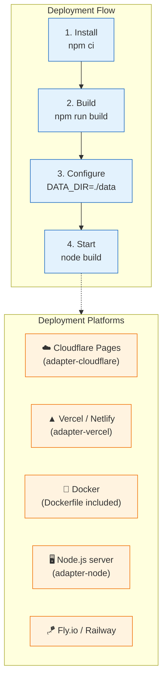
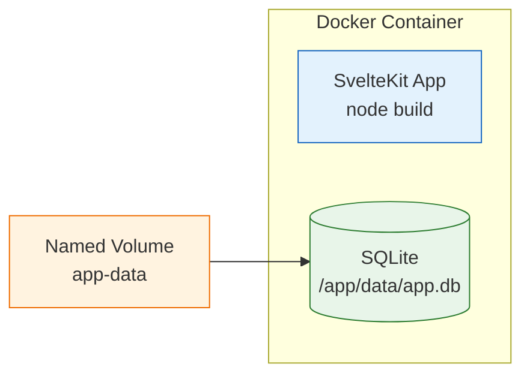

# Deployment

This kit is a self-contained SvelteKit application with an embedded **SQLite** database. No external database server required — just deploy the app anywhere SvelteKit runs.



## 1. Quick start (local)

```bash
npm install
npm run dev    # http://localhost:5173
```

Data lives in `./data/app.db` (override with `DATA_DIR`). Migrations apply automatically at startup.

## 2. Deploy with Docker

A `Dockerfile` and `docker-compose.yml` are included for container deployments.

### Build and run

```bash
docker compose up -d        # build + start on http://localhost:5173
docker compose logs -f      # follow logs
docker compose down         # stop (data persists in the named volume)
```

### How it works



- The SQLite database is persisted in a Docker named volume (`app-data`).
- Environment variables can be overridden via `docker-compose.yml` or `.env`.
- Health checks are configured (HTTP GET on `/`).

### Environment variables

| Variable               | Default     | Purpose                                 |
| ---------------------- | ----------- | --------------------------------------- |
| `DATA_DIR`             | `/app/data` | SQLite file location (inside container) |
| `PORT`                 | `5173`      | HTTP listen port                        |
| `MOCK_PLAN_SEATS`      | `3`         | Seat limit while on MockBilling         |
| `AUTH_FAILED_ATTEMPTS` | `5`         | Failed attempts per window              |
| `AUTH_WINDOW_MS`       | `900000`    | Sliding window (15 min)                 |

### Multi-instance caveat

SQLite is **single-writer** — it works fine behind a load balancer for read-heavy workloads, but concurrent writes from multiple containers will contend. For multi-instance deployments, consider:

- **Single container** with `docker compose` (simplest)
- **Swap to Postgres** — the service layer is portable (see `docs/architecture.md` → "Swapping the database")
- **SQLite + Litestream** for replication to S3 (read replicas)

## 3. Deploy to Cloudflare Pages

```bash
# 1. Pin the adapter
npm install -D @sveltejs/adapter-cloudflare

# 2. Update vite.config.ts
import adapter from '@sveltejs/adapter-cloudflare';
adapter()

# 3. Deploy
npx wrangler pages deploy build
```

**Note:** Cloudflare Workers/Pages uses a read-only filesystem. SQLite must live on a persistent storage backend (R2 via a Worker, or swap to D1/Postgres).

## 4. Deploy to Vercel / Netlify

```bash
# 1. Pin the adapter
npm install -D @sveltejs/adapter-vercel   # or adapter-netlify

# 2. Update vite.config.ts
import adapter from '@sveltejs/adapter-vercel';
adapter()

# 3. Deploy via Git integration or CLI
npx vercel --prod
```

**Note:** Serverless platforms may have ephemeral filesystems. SQLite works on Vercel's Serverless Functions (persistent `/tmp`), but for production consider a managed database.

## 5. Deploy to a VPS (Node.js server)

```bash
# On your server
git clone <repo-url> && cd multi-tenant-sveltekit-starter
npm ci
npm run build

# Run with a process manager
npx pm2 start build --name multi-tenant-starter
# or
npm run start   # if using adapter-node
```

Set `DATA_DIR` to a persistent path (e.g., `/var/lib/multi-tenant/data`).

## 6. Deploy to Fly.io / Railway

```bash
# Fly.io
fly launch
fly deploy

# Railway
# Connect your Git repo — Railway auto-detects Node.js
```

Both platforms provide persistent volumes for SQLite data.

## 7. Swapping to Postgres

The service layer accepts any `Db` — swap SQLite for Postgres by replacing `src/lib/server/db/index.ts`:

```ts
// Before: SQLite
import Database from 'better-sqlite3';
const sqlite = new Database(path.join(dataDir, 'app.db'));

// After: Postgres
import postgres from 'postgres';
const client = postgres(process.env.DATABASE_URL!);
```

See the [SvelteKit + Postgres Starter](https://github.com/verdantstack/sveltekit-postgres-starter) for a complete Postgres implementation with the same service layer.

## 8. Production checklist

- [ ] Set `DATA_DIR` to a persistent, backed-up path
- [ ] Configure `AUTH_FAILED_ATTEMPTS` and `AUTH_WINDOW_MS` for your security needs
- [ ] Replace `MockBillingAdapter` with a real billing provider (see `docs/billing.md`)
- [ ] Enable HTTPS (reverse proxy with Caddy/Nginx, or use a platform that provides it)
- [ ] Set up automated backups of the SQLite file
- [ ] Monitor disk space (SQLite grows with audit log entries)
